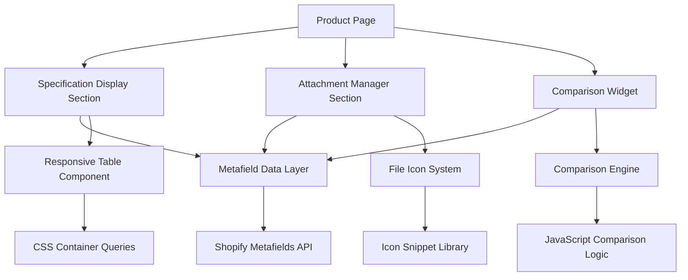

# Design Document

## Overview

The Advanced Product Specification System provides native Shopify functionality for displaying technical specifications, product comparisons, and downloadable attachments. The system leverages Shopify's metafield infrastructure and integrates seamlessly with the existing Forge Industrial theme architecture.

## Architecture

### System Components



### Data Architecture

The system uses Shopify's native metafield system with structured namespaces:

- `specifications.technical` - Technical specification data
- `specifications.categories` - Specification grouping
- `attachments.files` - File attachment metadata
- `attachments.categories` - Attachment categorization

## Components and Interfaces

### 1. Specification Display Component

**File:** `sections/product-specs.liquid`

**Purpose:** Renders technical specifications in organized, responsive tables

**Key Features:**
- Collapsible specification categories
- Unit-aware value formatting
- Range and tolerance display
- Rich text support for descriptions

**Interface:**
```liquid

```

### 2. Product Comparison Engine

**File:** `assets/product-comparison.js`

**Purpose:** Client-side comparison functionality with persistent state

**Key Features:**
- Up to 4 product comparison
- Difference highlighting
- Responsive comparison tables
- URL state persistence

**Interface:**
```javascript
class ProductComparison {
  addProduct(productId)
  removeProduct(productId)
  renderComparison(container)
  exportComparison(format)
  shareComparison()
}
```

### 3. Attachment Manager

**File:** `snippets/product-attachments.liquid`

**Purpose:** Displays categorized downloadable files with appropriate icons

**Key Features:**
- File type detection and icons
- Category-based organization
- Download tracking
- Access control integration

**Interface:**
```liquid

```

### 4. Specification Search Engine

**File:** `assets/spec-search.js`

**Purpose:** Real-time specification search and filtering

**Key Features:**
- Fuzzy text matching
- Range-based filtering
- Multi-criteria combination
- Search result highlighting

### 5. Cost Savings Calculator

**File:** `sections/cost-savings-calculator.liquid`

**Purpose:** Interactive calculator demonstrating theme value proposition

**Key Features:**
- Monthly/annual app cost calculations
- ROI analysis and payback period
- Visual comparison charts
- Feature parity demonstrations

**Interface:**
```liquid

```

## Data Models

### Specification Data Structure

```json
{
  "specifications": {
    "technical": {
      "dimensions": {
        "length": {"value": "1200", "unit": "mm", "tolerance": "±5"},
        "width": {"value": "800", "unit": "mm", "tolerance": "±3"},
        "height": {"value": "400", "unit": "mm", "tolerance": "±2"}
      },
      "performance": {
        "max_pressure": {"value": "150", "unit": "PSI", "range": "0-150"},
        "flow_rate": {"value": "50", "unit": "GPM", "range": "10-50"},
        "temperature_range": {"min": "-20", "max": "80", "unit": "°C"}
      },
      "materials": {
        "housing": {"value": "316 Stainless Steel", "description": "Corrosion resistant"},
        "seals": {"value": "Viton", "description": "Chemical compatible"}
      }
    },
    "categories": {
      "dimensions": {"name": "Dimensions", "order": 1, "collapsible": true},
      "performance": {"name": "Performance", "order": 2, "collapsible": true},
      "materials": {"name": "Materials", "order": 3, "collapsible": false}
    }
  }
}
```

### Attachment Data Structure

```json
{
  "attachments": {
    "files": [
      {
        "id": "manual_001",
        "name": "Installation Manual",
        "url": "https://cdn.shopify.com/files/manual.pdf",
        "type": "pdf",
        "size": "2.4 MB",
        "category": "manuals",
        "description": "Complete installation and setup guide"
      },
      {
        "id": "cad_001", 
        "name": "3D CAD Model",
        "url": "https://cdn.shopify.com/files/model.step",
        "type": "step",
        "size": "15.2 MB",
        "category": "cad",
        "description": "STEP format 3D model for CAD integration"
      }
    ],
    "categories": {
      "manuals": {"name": "Manuals & Guides", "icon": "file-manual", "order": 1},
      "cad": {"name": "CAD Files", "icon": "file-cad", "order": 2},
      "certificates": {"name": "Certificates", "icon": "file-safety", "order": 3}
    }
  }
}
```

### Cost Savings Data Structure

```json
{
  "cost_savings": {
    "theme_price": 320,
    "app_categories": {
      "loyalty": {"monthly_cost": 125, "features": ["tier_system", "rewards", "progress_tracking"]},
      "seo": {"monthly_cost": 35, "features": ["structured_data", "rich_snippets", "meta_optimization"]},
      "mega_menu": {"monthly_cost": 22, "features": ["multi_column", "featured_content", "mobile_responsive"]},
      "faq": {"monthly_cost": 17, "features": ["searchable", "categories", "analytics"]},
      "attachments": {"monthly_cost": 27, "features": ["file_management", "categories", "access_control"]},
      "pwa": {"monthly_cost": 40, "features": ["installable", "offline_support", "push_notifications"]}
    },
    "comparison_themes": [
      {"name": "Popular Theme A", "price": 180, "monthly_apps": 266},
      {"name": "Popular Theme B", "price": 250, "monthly_apps": 198},
      {"name": "Popular Theme C", "price": 300, "monthly_apps": 234}
    ]
  }
}
```

## Correctness Properties

*A property is a characteristic or behavior that should hold true across all valid executions of a system-essentially, a formal statement about what the system should do. Properties serve as the bridge between human-readable specifications and machine-verifiable correctness guarantees.*


### Property 1: Specification Rendering Completeness

*For any* product with technical specifications, rendering the specification display should produce a structured table containing all specification categories, values with units, ranges with tolerances, and rich text descriptions properly formatted.

**Validates: Requirements 1.1, 1.2, 1.3, 1.4, 1.5**

### Property 2: Comparison Side-by-Side Layout

*For any* set of 2-4 products selected for comparison, the comparison engine should display their specifications in side-by-side columns with differences highlighted.

**Validates: Requirements 2.1, 2.2**

### Property 3: Comparison Missing Value Handling

*For any* set of products with different specification categories, the comparison display should gracefully handle missing values by showing empty cells or "N/A" without breaking table structure.

**Validates: Requirements 2.3**

### Property 4: Comparison Product Limit

*For any* comparison attempt, the system should accept up to 4 products and reject attempts to add a 5th product.

**Validates: Requirements 2.4**

### Property 5: Print Format Preservation

*For any* specification or comparison table, applying print styles should maintain readable table structure and formatting.

**Validates: Requirements 2.5, 7.3**

### Property 6: Attachment Display Completeness

*For any* product with attachments, the attachment manager should display each file with an appropriate icon, category grouping, file size, and format information.

**Validates: Requirements 3.1, 3.2, 3.4**

### Property 7: Attachment Click Behavior

*For any* attachment, clicking it should either initiate a download or open in a new tab based on file type.

**Validates: Requirements 3.3**

### Property 8: Attachment Access Control

*For any* attachment marked as requiring authentication, the system should only allow access when a customer is logged in.

**Validates: Requirements 3.5**

### Property 9: Metafield Data Round-Trip

*For any* valid specification data structure, storing it to Shopify metafields and then retrieving it should produce an equivalent data structure.

**Validates: Requirements 4.1**

### Property 10: Specification Update Synchronization

*For any* specification update in the admin, the storefront should reflect the changes within the next page load.

**Validates: Requirements 4.3**

### Property 11: Bulk Import/Export Round-Trip

*For any* set of product specifications, exporting them and then re-importing should produce equivalent specification data.

**Validates: Requirements 4.4**

### Property 12: Specification Data Validation

*For any* specification data input, the system should reject invalid formats (missing required fields, incorrect data types, malformed JSON) and accept valid formats.

**Validates: Requirements 4.5**

### Property 13: Mobile Responsive Behavior

*For any* specification display, comparison table, or attachment list viewed on mobile viewport, the system should apply appropriate responsive behavior (horizontal scrolling for wide tables, vertical stacking for comparisons, optimized images).

**Validates: Requirements 5.1, 5.2, 5.3, 5.5**

### Property 14: Search Matching Comprehensiveness

*For any* search query, the search engine should match against both specification names and values, and highlight all matching text in results.

**Validates: Requirements 6.1, 6.4**

### Property 15: Range Filter Correctness

*For any* min/max range filter applied to specifications, the system should only return products whose specification values fall within the specified range.

**Validates: Requirements 6.2**

### Property 16: Multi-Filter AND Logic

*For any* combination of multiple specification filters, the system should return only products that match ALL filters (AND logic, not OR).

**Validates: Requirements 6.3**

### Property 17: Empty Search Results Messaging

*For any* search or filter combination that returns zero results, the system should display helpful messaging suggesting alternative searches.

**Validates: Requirements 6.5**

### Property 18: Export Format Completeness

*For any* specification or comparison export, the generated PDF should include proper table formatting, product images, branding, and maintain comparison structure for multi-product exports.

**Validates: Requirements 7.1, 7.4, 7.5**

### Property 19: Shareable URL State Preservation

*For any* product comparison, generating a shareable URL and loading that URL should restore the exact same comparison state (same products, same view).

**Validates: Requirements 7.2**

### Property 20: Theme Integration Consistency

*For any* specification display, the rendered output should use the theme's CSS custom properties (design tokens) and adapt to the active preset's color scheme and typography.

**Validates: Requirements 8.1, 8.3**

### Property 21: Variant-Specific Specifications

*For any* product with multiple variants, selecting a variant should display only the specifications relevant to that specific variant.

**Validates: Requirements 8.2**

### Property 22: Template Compatibility

*For any* page template or section group, adding the specification section should render correctly without breaking layout.

**Validates: Requirements 8.4**

### Property 23: Empty State Graceful Hiding

*For any* product without specifications, the specification display section should hide completely without leaving empty space or broken layout.

**Validates: Requirements 8.5**

### Property 24: Cost Savings Calculator Accuracy

*For any* theme price and app cost data, the cost savings calculator should produce accurate monthly and annual cost calculations showing the difference between theme cost and app subscriptions.

**Validates: Requirements 9.1, 9.3**

### Property 25: App Ecosystem Cost Display

*For any* theme comparison data, the system should display typical app ecosystem costs for other themes with accurate monthly and annual totals.

**Validates: Requirements 9.2**

### Property 26: Feature Parity Demonstration

*For any* built-in feature, the system should demonstrate equivalent functionality to popular third-party apps with clear feature comparisons.

**Validates: Requirements 9.4**

### Property 27: Cost Comparison Chart Generation

*For any* cost comparison data, the system should generate visual charts showing cost over time comparisons between the theme and app-based solutions.

**Validates: Requirements 9.5**

## Error Handling

### Metafield Data Errors

**Scenario:** Malformed or missing metafield data

**Handling:**
- Validate JSON structure before parsing
- Provide default empty state for missing data
- Log errors to browser console for debugging
- Display user-friendly message: "Specifications not available"

### File Attachment Errors

**Scenario:** Broken file URLs or inaccessible files

**Handling:**
- Validate file URLs before rendering
- Show disabled state for broken attachments
- Provide fallback icon for unknown file types
- Display error message: "File temporarily unavailable"

### Comparison State Errors

**Scenario:** Invalid product IDs in comparison or URL state corruption

**Handling:**
- Validate product IDs against available products
- Remove invalid products from comparison
- Reset comparison state if completely corrupted
- Preserve valid products in comparison

### Search/Filter Errors

**Scenario:** Invalid filter values or search syntax errors

**Handling:**
- Sanitize search input to prevent XSS
- Validate numeric ranges before filtering
- Ignore invalid filters rather than failing
- Show warning for ignored invalid filters

## Testing Strategy

### Unit Testing Approach

The system will use a combination of unit tests and property-based tests:

**Unit Tests** will cover:
- Specific metafield data parsing examples
- Known file type icon mappings
- Edge cases (empty data, single product, maximum products)
- Error condition handling
- Integration with theme components

**Property-Based Tests** will cover:
- Specification rendering across random data structures
- Comparison logic with various product combinations
- Search and filter behavior with random queries
- Export functionality with random specification sets
- Responsive behavior across viewport sizes

### Property-Based Testing Configuration

**Framework:** fast-check (JavaScript property-based testing library)

**Configuration:**
- Minimum 100 iterations per property test
- Each test tagged with feature name and property number
- Tag format: `Feature: product-specification-system, Property N: [property text]`

**Example Test Structure:**
```javascript
// Feature: product-specification-system, Property 1: Specification Rendering Completeness
fc.assert(
  fc.property(
    specificationDataGenerator(),
    (specData) => {
      const rendered = renderSpecifications(specData);
      return containsAllCategories(rendered, specData) &&
             containsAllValues(rendered, specData) &&
             containsAllUnits(rendered, specData);
    }
  ),
  { numRuns: 100 }
);
```

### Testing Priorities

1. **Critical Path:** Metafield data round-trip (Property 9)
2. **High Priority:** Specification rendering (Property 1), Comparison logic (Properties 2-4)
3. **Medium Priority:** Search/filter (Properties 14-17), Mobile responsive (Property 13)
4. **Lower Priority:** Export functionality (Properties 18-19), Theme integration (Properties 20-23)

### Manual Testing Requirements

- Test across all 12 preset themes for visual consistency
- Test on actual Shopify development store
- Verify metafield admin interface usability
- Test file downloads across different browsers
- Validate print output on physical printers
- Test mobile behavior on real devices (not just emulators)

## Implementation Notes

### Shopify Metafield Considerations

- Use `product.metafields.specifications` namespace
- Leverage Shopify's metafield definitions for structured data
- Consider metafield size limits (64KB per metafield)
- Use multiple metafields if data exceeds limits

### Performance Considerations

- Lazy load comparison JavaScript only when needed
- Use CSS container queries for responsive behavior (no JavaScript)
- Cache parsed metafield data in Liquid variables
- Optimize file icon SVGs for inline rendering
- Use Intersection Observer for lazy-loading specification images

### Accessibility Requirements

- All tables must have proper `<thead>`, `<tbody>` structure
- Use `aria-label` for comparison controls
- Ensure keyboard navigation for comparison selection
- Provide text alternatives for file type icons
- Maintain WCAG 2.1 AA contrast ratios in all themes

### Browser Compatibility

- Support modern browsers (last 2 versions)
- Graceful degradation for older browsers
- Progressive enhancement approach
- No JavaScript required for basic specification display
- Comparison feature requires JavaScript (progressive enhancement)
